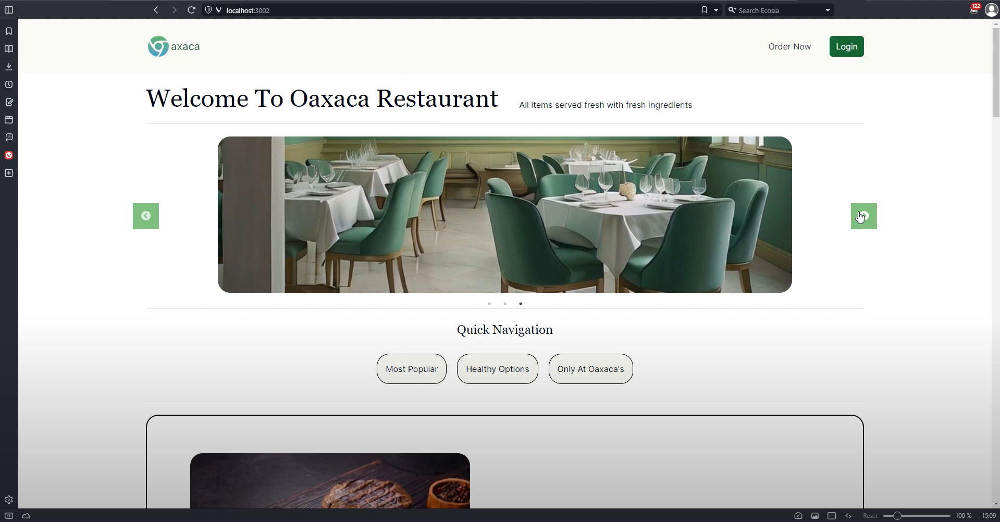

# Oaxaca Restaurant — Full-Stack Restaurant Management System


A full-stack restaurant management web application built by a team of 8 university developers over a semester-long Agile project. The system handles the complete lifecycle of a restaurant visit — from menu browsing and ordering through to kitchen management and table turnover.

---

## Screenshot



---

## Overview

Oaxaca Restaurant supports three user roles:

| Role | What they can do |
|---|---|
| **Customer** | Browse the menu, place orders, reserve tables, track order status in real time, view allergen and calorie info |
| **Waiter** | View and manage all incoming orders, receive waiter notifications, handle table states |
| **Chef / Kitchen Staff** | View orders queued for cooking, update order status, manage the menu |

The application separates the customer-facing storefront from the staff dashboard. Each role sees only the navigation and controls relevant to them.

---

## Feature Highlights

- **Live order tracking** — customers see their orders update from *Cooking* to *Done* with a visual progress bar
- **Role-based navigation** — the navbar adapts dynamically based on the authenticated user's role (Customer / Waiter / Chef)
- **Table reservation system** — customers can view table availability and book a table; staff can mark tables as occupied, finished, or needing cleaning
- **Menu management** — kitchen staff can add, edit, and remove menu items through the admin dashboard
- **Waiter notifications** — customers can call a waiter from their table; the notification is pushed to the waiter dashboard
- **Allergen and calorie information** — dedicated popups with dietary information for each menu item
- **Payment processing** — checkout flow with order summary and payment handling
- **JWT authentication** — secure login/signup with role-based access control and persistent session via `localStorage`
- **Guest ordering** — customers can browse and order without creating an account

---

## Tech Stack

| Layer | Technology |
|---|---|
| **Frontend** | Next.js 14, React 18, Tailwind CSS, Radix UI, Axios, React Hook Form |
| **Animations / UI** | react-awesome-reveal, react-slick, react-scroll, lucide-react |
| **Backend** | Spring Boot 3.2.2, Java 17, Spring Data JPA, Lombok |
| **Database** | PostgreSQL (production), H2 in-memory (tests) |
| **Authentication** | JWT (`jjwt 0.11.5`), role-based access control |
| **Build / CI** | Maven, GitLab CI/CD (4-stage pipeline) |
| **Code Quality** | Google+ Checkstyle via `maven-checkstyle-plugin` |
| **Testing** | JUnit 5, Mockito |

---

## My Contributions

> I worked as a full-stack contributor across the Spring Boot backend and the Next.js frontend. I completed and finalized the waiter notification module, extended the menu management UI and backend, added status management and order actions to the team's kitchen staff dashboard, built the customer menu filtering experience, wired role-based UI rendering from backend to frontend, and wrote a global CORS filter to unblock frontend–backend integration.

---

### 1. Waiter Notification System — Backend

**Files:** `backend/src/main/java/restaurant/notification/`

A teammate (zjac003) created an initial skeleton entity and service in an earlier `notif` package. I rebuilt and completed the entire notification module in a new `notification` package — restructuring the entity, implementing the full service layer, writing the REST controller, defining the status enum, and adding the data seeder. The source files reflect co-authorship with Kasim (zjac003) on the entity, repository, and service.

When a customer triggers a "call waiter" action, a notification is persisted and surfaces on the waiter dashboard.

- **`Notification.java`** *(co-authored with Kasim)* — JPA entity mapped to the `Notification` table. Fields: `username` (the customer who called), `tableNumber`, `notificationTime` (auto-set via `@PostPersist`), and `NotificationStatus` stored as a string enum. The `@PostPersist` lifecycle hook records the exact timestamp at the moment of persistence — no manual timestamp management required.
- **`NotificationStatus.java`** *(sole author)* — Enum defining notification states, with a `convertFromString` utility method for deserialising plain-text HTTP request body values into the correct enum constant.
- **`NotificationRepository.java`** *(co-authored with Kasim)* — Spring Data JPA repository with a `findByTableNumber` derived query method for table-scoped lookups.
- **`NotificationService.java`** *(co-authored with Kasim)* — Service layer covering: get all, get by table number, add, remove by ID, delete all by table, and a `@Transactional` `updateNotificationStatus` method that fetches the entity, sets the new status, and saves.
- **`NotificationController.java`** *(sole author)* — REST controller at `/notification` with six endpoints:
  - `GET /` — fetch all notifications
  - `GET /getByTable/{tableNumber}` — fetch notifications for a specific table
  - `POST /add` — create a notification
  - `PUT /{notificationId}` — update notification status
  - `DELETE /deleteItemById/{notificationId}` — delete a single notification
  - `DELETE /deleteItemsByUser/{tableNumber}` — delete all notifications for a table
- **`NotificationConfig.java`** *(sole author)* — `CommandLineRunner` that seeds initial notification data on startup.

---

### 2. Menu Backend — Food Entity & Controller

**Files:** `backend/src/main/java/restaurant/menu/FoodController.java`, `Food.java`

- **`Food.java`** *(co-authored with Luque van der Merwe / ZLAC180)* — Extended the Food entity with `imgPath`, `description`, `category`, and `price` fields. Wrote their getters/setters, updated the multi-argument constructor, added a null-safety check in `FoodService`, and removed the unused `qty` field.
- **`FoodController.java`** *(primary author; sole `@author` tag)* — REST controller at `/foods` providing full CRUD:
  - `GET /foods` — list all menu items
  - `POST /foods` — add a new item
  - `DELETE /foods/{foodId}` — remove an item
  - `PUT /foods/{foodId}` — update an item

  The `PUT` endpoint accepts a `Map<String, Object>` request body and manually extracts and type-converts each field (including null-safe `Double.parseDouble` for price). This keeps the controller decoupled from a fixed DTO shape and allows partial updates where only the changed fields need to be sent.

---

### 3. Order Tracking — Status Management & Order Actions (full-stack, extending `admin-orders`)

**Commits:** `feat(OrderTracking): Kitchen Staff can now see orders from customers` · `feat(backend): backend can now save status updates of orders to repo` · `feat(OrderTracking): Added functionality to change status` · `feat(Frontend): Added Change and Remove buttons and Modal` · `feat(OrderTracking): Can now remove orders`

The order dashboard was a team effort: Parvesh Kumar created `admin-orders/page.jsx` and Ahmed Alyami implemented the foundational table structure, tabs, and action buttons in `admin-orders/order-list.jsx`. I then added the status-change functionality, order removal capability, and fixed several integration bugs across the stack.

- **Backend** — implemented `updateOrderStatus` in the service layer using `@Transactional`. The method fetches the order by ID, converts the incoming string to an `OrderStatus` enum value via `convertFromString`, sets it on the entity, and saves. Added the `PUT /{orderId}` endpoint routing in `ItemController.java` to expose this functionality. Fixed a bug where `username` was arriving as `null` on orders posted from the frontend.
- **Frontend** — extended the `admin-orders` order management view:
  - Added a status dropdown to change any order's status and a DELETE button with `handleDeleteOrder` to remove orders from the dashboard.
  - Fixed an ID display bug where all orders were rendering as ID `1` due to an incorrect field mapping.
  - Fixed table alignment issues in the order list.
- **Access control** — enforced that the dashboard routes are only accessible to users with the Waiter or Chef role, redirecting all others.

---

### 4. Menu Management Frontend (extended existing interface)

**Commits:** `feat(Menu): Can Add to Menu` · `feat(Menu): Can edit existing menu items` · `fix(Menu): Can now remove menu items` · `feat(Menu): Can now change imgPath when adding to menu` · `feat(Menu/User): Chef and Waiter can remove menu items` · `fix(Menu): Fix backend to handle menu update request`

Parvesh Kumar created `admin-menu/page.jsx` with the dialog form, input fields, and initial add-menu logic. I extended the interface with edit, delete, and image-path support:

- Added `imgPath` field to the existing add-menu form so staff can set the image when creating a new item
- Inline editing of existing items, saving changes via `PUT /foods/{foodId}`
- Delete functionality for removing items from the menu
- Conditional rendering of the "Change Menu" button — visible only to users with the Chef or Waiter role
- Fixed several issues with the `PUT /foods/{foodId}` backend endpoint during frontend–backend integration

---

### 5. Menu Filtering — Customer-Facing

**Commits:** `feat(Frontend): Added Menu filtering options (A-Z, Price High-Low, Price Low-High)` · `feat(MenuHeader): Made filter buttons on menu header change colour when clicked` · `(fix): Updated default sort order`

I added sort controls to the customer menu page:

- Alphabetical (A–Z) sort
- Price: low to high
- Price: high to low
- The active filter button is highlighted with a colour change to show which sort is currently applied
- Fixed the default sort order so the menu renders alphabetically on first load rather than in insertion order

---

### 6. User Role Display in Navbar

**Commits:** `feat(User): Sent user role from the backend and displayed it on navbar` · `feat(User Role): Added "Change Menu" button if you are roled a chef or waiter` · `fix(User Role): Update role condition in MenuPage component` · `fix(User Role): Fix logical operator in menu page`

Other teammates (ZKAC224 and Malcolm Berset) also contributed role-based navbar commits. My specific contribution was wiring the user's role from the Spring Boot `loginUser` response into the frontend `AuthContext` so it is available globally throughout the app, and then using it to conditionally render role-specific UI:

- The "Change Menu" button on the menu page is only rendered for Chef and Waiter roles
- Staff see "Dashboard" in the navbar; customers see "My Orders" instead

Fixed a logical operator bug (`||` instead of `&&`) in the role condition that was causing the button to appear for the wrong users.

---

### 7. Cross-Cutting Backend & Integration Work

Beyond the features above, I made several contributions across the stack that were necessary for end-to-end integration:

- **`SimpleCorsFilter.java`** — wrote a global servlet `Filter` registered at `Ordered.HIGHEST_PRECEDENCE` to handle CORS preflight (`OPTIONS`) requests. Sets `Access-Control-Allow-Origin`, `Access-Control-Allow-Methods`, `Access-Control-Allow-Headers`, and `Access-Control-Expose-Headers` globally, and returns `HTTP 200` for all `OPTIONS` requests before they reach any controller. This unblocked all frontend-to-backend communication during development.
- **`UserController.java` / `UserService.java`** — modified the `loginUser` endpoint to return the full `User` object (including `role`) in the response body, enabling the frontend to implement role-based UI rendering.
- **`ItemController.java`** — added the `PUT /{orderId}` endpoint to route order status-update requests from the frontend to the service layer.
- **`providers/auth.jsx`** — updated the `AuthContext` provider to store the user's role from the login response, making it accessible to any component in the app via `useContext`.
- **`basket/page.jsx`** — fixed a bug where the username was not being included in order POST requests, causing `null` username values in the database.
- **Auth page restructuring** — reorganised the login and signup pages into a `(auth)` route group for cleaner Next.js routing.

---

## Technical Challenges

**Completing the notification module from a skeleton**
A teammate had started a skeleton `notif` package with a basic entity and service, but it was incomplete and structurally inconsistent with the rest of the codebase. I rebuilt the module from that starting point into a fully independent `notification` package — its own JPA entity, repository, service, controller, and data seeder — modelled on the existing order module to stay consistent with the team's architecture. I added the `@PostPersist` lifecycle hook so the `notificationTime` is always set atomically on insert with no risk of it being missed.

**Flexible menu update endpoint**
The `PUT /foods/{foodId}` endpoint needed to support partial updates where only some fields are provided. Rather than binding to a fixed DTO, I accepted a `Map<String, Object>` request body and manually extracted each field with null-safe type conversion. This lets the frontend send only the fields being edited without the backend rejecting an incomplete payload.

**Order status backend integration**
The frontend sends status values as plain strings (e.g. `"cooking"`), but the backend models them as a typed `OrderStatus` enum. The string had to go through a `convertFromString` method before being assigned to the entity. I also traced and fixed a null `username` bug where the user object was not being fully included in the order POST request from the frontend.

**Role-based UI rendering**
After propagating the user role into the `AuthContext`, the conditional rendering logic required precision. A single wrong operator (`||` instead of `&&`) caused the "Change Menu" button to appear for the wrong users. I identified the root cause and fixed it.

**Cross-origin request handling**
During frontend–backend integration, the Next.js dev server on port 3000 could not reach the Spring Boot API on port 8080 due to browser CORS enforcement. Rather than scattering `@CrossOrigin` annotations on every controller, I wrote a global `SimpleCorsFilter` registered at `Ordered.HIGHEST_PRECEDENCE` that intercepts all preflight `OPTIONS` requests and sets the correct `Access-Control-Allow-*` headers. This removed CORS as a blocker for the entire team.

---

## Engineering Practices

### Agile / Scrum
The project followed Agile Scrum methodology across the full semester. Work was divided into sprints, features were broken into user stories, and progress was tracked across a team of 8. All development happened on GitLab feature branches, with merge requests used to integrate completed work into `main`.

### CI/CD Pipeline
A GitLab CI/CD pipeline ran automatically on every push, enforcing four stages:

```
build → test → validation (checkstyle) → package
```

| Stage | What it does |
|---|---|
| `build` | `mvn clean compile` — verifies the project compiles |
| `test` | `mvn test` — runs all JUnit tests |
| `validation` | `mvn checkstyle:check` — enforces Google+ code style |
| `package` | `mvn package` — produces the deployable `.jar` artifact |

The packaged `.jar` is stored as a CI artifact for 30 days.

### Test-Driven Development
The team followed a TDD approach with explicit red/green cycles tracked in the commit history. Tests were written using JUnit 5 and Mockito, with an H2 in-memory database substituted for PostgreSQL during test runs to keep them fast and isolated from external state.

### Code Quality
Google+ Checkstyle was enforced via the Maven Checkstyle plugin and configured to fail the build on any violation. This kept the codebase consistent across all 8 contributors throughout the project.

---

## Testing

The backend has **16 JUnit 5 test files** organised by module, using Mockito for dependency mocking:

| Module | Test files |
|---|---|
| `login` | `UserTest`, `UserServiceTest`, `UserControllerTest` |
| `menu` | `FoodTest`, `FoodServiceTest`, `FoodControllerTest` |
| `order` | `ItemTest`, `ItemServiceTest`, `ItemControllerTest` |
| `table` | `TableControllerTest`, `TableServiceTest`, `TableReservationTest` |
| `notification` | `NotificationServiceTest`, `NotificationControllerTest` |
| `application` | `ApplicationTests`, `ContextTest` |

Controllers are tested with `@ExtendWith(MockitoExtension.class)` and `@InjectMocks` / `@Mock` annotations, isolating the controller layer from the database entirely.

---

## Project Structure

```
TeamProject07/
├── backend/                          Spring Boot REST API
│   └── src/
│       ├── main/java/restaurant/
│       │   ├── SimpleCorsFilter.java     Global CORS filter            ← my contribution
│       │   ├── login/                    User entity, JWT auth
│       │   ├── menu/                     Food entity, menu CRUD        ← co-authored / extended
│       │   ├── order/                    Item entity, order management  ← added status endpoint
│       │   ├── table/                    Table reservation system
│       │   └── notification/             Waiter notification system     ← completed module
│       └── test/java/restaurant/         JUnit 5 + Mockito test suites
│
└── frontend/                             Next.js 14 application
    └── src/app/
        ├── (customer)/                   Customer route group
        │   ├── page.jsx                  Homepage (carousel, featured dishes)
        │   ├── menu/                     Menu browsing with filters     ← built filtering
        │   ├── basket/                   Cart and checkout              ← fixed username bug
        │   ├── myorders/                 Order tracking with progress bar
        │   ├── table/                    Table reservation
        │   └── (auth)/login|signup       Authentication pages           ← restructured
        ├── (admin)/                      Staff route group
        │   ├── dashboard/                Waiter and chef order dashboard
        │   ├── admin-kitchenstaff/       Kitchen staff order view
        │   ├── admin-orders/             Full order management view     ← extended with status/delete
        │   └── admin-menu/               Menu management interface      ← extended with edit/delete
        ├── components/                   Shared components (navbar, footer)
        └── providers/                    AuthContext, CartContext        ← added role storage
```

---

## Getting Started

### Backend

Requires Java 17, Maven, and a PostgreSQL instance.

```bash
cd backend
mvn clean install
mvn spring-boot:run
```

The API runs on `http://localhost:8080` by default.

Before running, update `src/main/resources/application.properties` with your local PostgreSQL credentials:

```properties
spring.datasource.url=jdbc:postgresql://localhost:5432/restaurant
spring.datasource.username=postgres
spring.datasource.password=your_password_here
```

You will also need to create the `restaurant` database in PostgreSQL before starting the app.

### Frontend

Requires Node.js 18+.

```bash
cd frontend
npm install
npm run dev
```

The frontend runs on `http://localhost:3000`. Ensure the Spring Boot backend is also running on `http://localhost:8080` as the frontend makes API calls directly to it.

---

## Team

Built by a team of 8 as a university Software Engineering team project.
